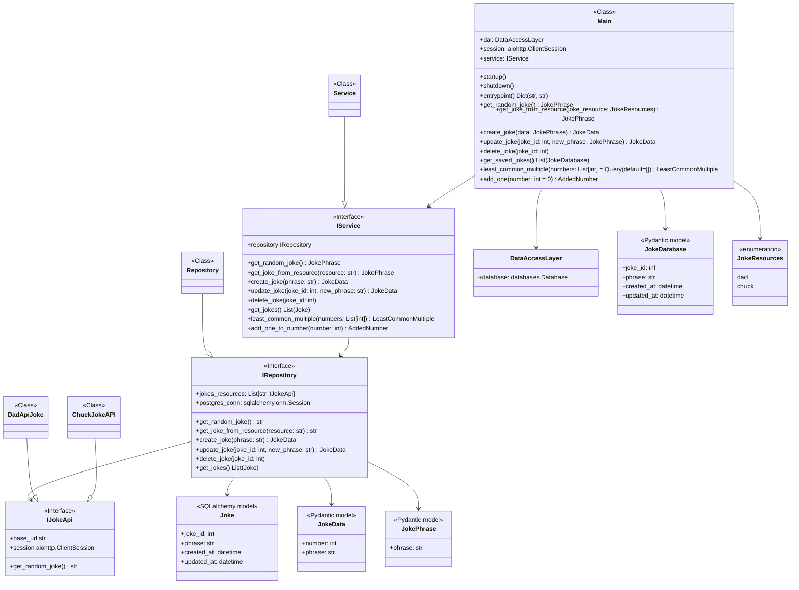

# Jokes and Maths!

This is a [SquadMakers](https://squadmakers.com) Backend test for Python. It consists in create a FastAPI with TDD (Unit testing) for handle Jokes CRUD, 3rd party APIs integrations for get random jokes depending on the selected resource and handle some Maths operations (LCM and Addition).

## How to run

This project is Dockerized, so you will not be worried about dependencies. Just make sure you have `docker` and `docker-compose` installed in your device.
To run the project for the first time, you will need to write this command down on your bash:

    docker-compose up -d --build
    docker exec -it api-jokes alembic upgrade head

## Dockerized

As mentioned in the previous section, this project is dockerized. In the `docker-compose.yml` file you notice that `FastAPI API` and a `PostgreSQL image` was configured in order to run the project.

## Migrations

`Alembic` library was used for migration tracking. So, when you run the project for the first time, you will need to run migrations in order to populate PostgreSQL container. To do that, just run the following command after the project is up:

    docker exec -it api-jokes alembic upgrade head

## API documentation

FastAPI instagrates `Swagger` for documentation. You can access by going to the following URL:

    /docs
    
    ex:
    http://localhost:4002/docs
    

## Environment

This is how the Environment variables file looks like:

    CHUCK_JOKES_API=
    DAD_JOKES_API=
    POSTGRES_HOST=
    POSTGRES_PORT=
    POSTGRES_USER=
    POSTGRES_PASSWORD=
    POSTGRES_DB_NAME=
    API_PORT=
For the sake of the test, the `.env` file will be tracked in the repository.

## Pre-commit hooks

This project implement `pre-commit` library. This library allows you to run validations before commits or pushes.
Here, `MyPy`, `Flake8` and `Pytest` hooks were configured to run before any `commit` or `push`.

## UML diagrams

UML class diagram created by [Mermaid](https://mermaidjs.github.io/). 

